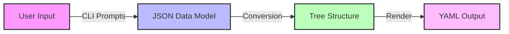
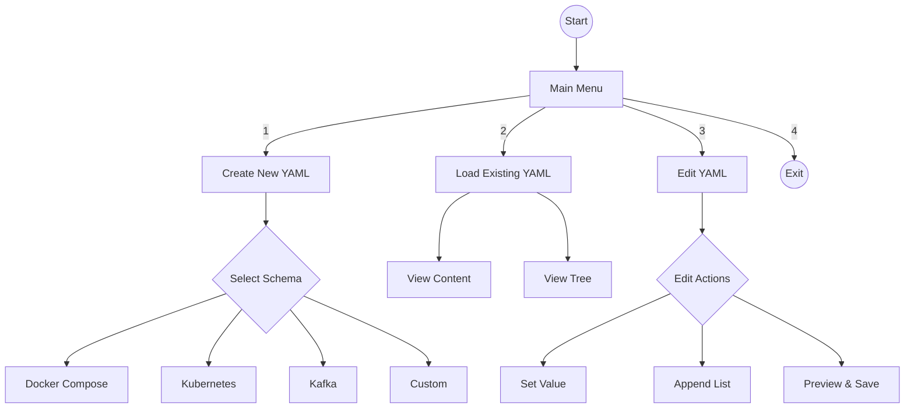

# ContainCraft - YAML Builder CLI

## Project Overview

ContainCraft is a command-line interface (CLI) tool designed to simplify the creation, loading, and editing of YAML configuration files. Built with Python and Rich, it provides an interactive, user-friendly experience for managing YAML files with support for multiple predefined schemas including Docker Compose, Kubernetes, Kafka, and custom configurations.


The application implements a complete workflow:




## Features

- **Interactive YAML Creation**: Build YAML files through guided interactive prompts using predefined schemas.
- **Multiple Schema Support**: 
  - Docker Compose (services, ports, volumes, environment variables)
  - Kubernetes (Deployments and Services)
  - Kafka Configuration
  - Custom YAML Builder (flexible key-value structure)
- **YAML Loading**: Load and display existing YAML files with syntax-highlighted preview.
- **YAML Editing**: Edit YAML files in-process with preview and undo functionality before saving.
- **Tree Visualization**: Display loaded YAML as an indented tree structure for easy navigation.
- **Path-based Navigation**: Access nested YAML values using dot notation (e.g., `services.kafka.environment.KAFKA_BROKER_ID`) the user can save both the absolute and relative path if the path is not mentioned then it defaults to current directory.
- **Rich CLI Interface**: Beautiful, colored output with panels, syntax highlighting, and responsive design.

## Installation

### Prerequisites

- Python 3.8 or higher
- pip (Python package manager)

### Setup

1. Clone or download the project to your local machine:

```bash
git clone https://github.com/yourusername/ContainCraft.git
cd ContainCraft
```


2. Create and activate a virtual environment (recommended):
```bash
python -m venv venv
.\venv\Scripts\Activate.ps1  # On Windows PowerShell
# or
source venv/bin/activate     # On Linux/macOS
```

3. Install dependencies:
```bash
pip install -r requirements.txt
```

## Usage

### Starting the Application


```bash
python CLI.py
```


The CLI will display the main menu with four options:

### Menu Options

### User Interaction Flow




### Examples

#### Creating Docker Compose Configuration

```
1. Run: python .\CLI.py
2. Select: 1 (Create new YAML)
3. Choose: Docker Compose
4. Input service details when prompted
5. Save as: docker-compose.yaml
```

#### Editing YAML File

```
1. Select: 3 (Edit YAML)
2. Enter path: new.yaml
3. Choose: 4 (Show available keys)
4. Explore structure
5. Choose: 1 (Set value at path)
6. Enter full path: services.kafka.environment.KAFKA_BROKER_ID
7. Enter new value: 2
8. Choose: 6 (Preview and save)
9. Confirm save
```


## Tips

### Path Notation
When editing, you can access nested values using dot notation:
- Simple keys: `services`
- Nested keys: `services.kafka.environment`
- Leaf values: `services.kafka.environment.KAFKA_BROKER_ID`

### Validation
Before deploying generated YAML files, it is recommended to verify them:
- **Docker Compose**: Run `docker-compose config`
- **Kubernetes**: Run `kubectl apply --dry-run=client -f <file>`
- **Kafka**: Verify against your broker version documentation.


## Troubleshooting

### Common Issues

**Issue**: Path not found when loading YAML
- **Solution**: Use absolute paths or relative paths from the working directory

**Issue**: Changes not visible after editing
- **Solution**: Ensure option 6 (Preview and save) is selected and confirmed with 'y'

**Issue**: Invalid YAML generated
- **Solution**: Verify input values don't contain special characters requiring escaping

**Issue**: TypeError in path navigation
- **Solution**: Verify full path is correct and values exist; use option 4 to explore structure

## Contributing Guidelines

When extending this project:
1. Maintain the existing code structure and organization
2. Add type hints to new functions
3. Follow naming conventions (snake_case for functions, PascalCase for classes)
4. Update this README for new features
5. Test thoroughly before deployment

## License

This project is provided as-is for educational and commercial use.

## Support and Maintenance

For issues or questions:
1. Review the examples section above
2. Check the troubleshooting section
3. Verify input against schema requirements
4. Consult official documentation for target formats (Docker, Kubernetes, Kafka)

---
